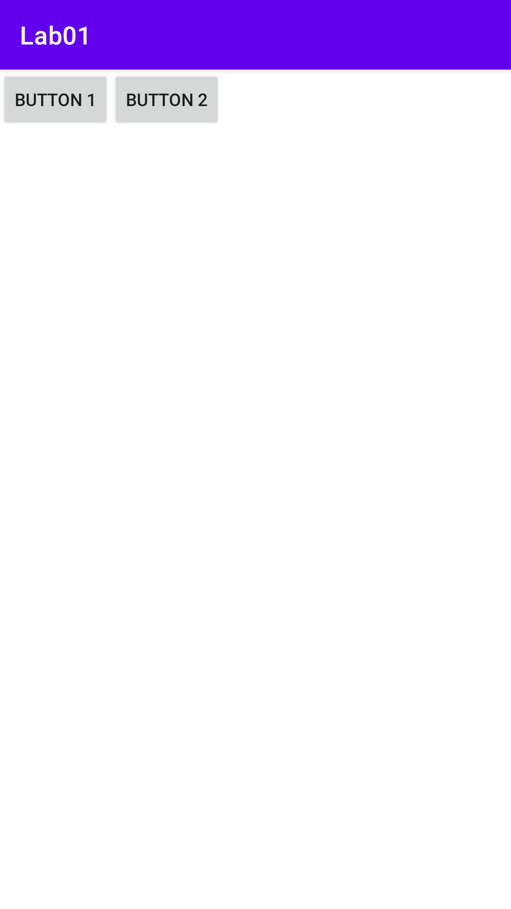
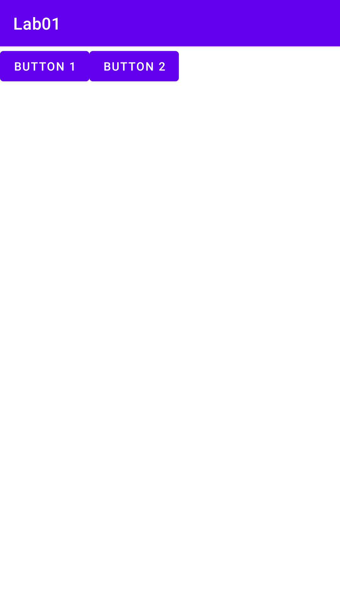

- ## 자바로 화면 설계하기
   + Activity에서 작업
   + 자바 코드로 화면을 디자인
   
```java
public class Lab01MainActivity extends AppCompatActivity {

    @Override
    protected void onCreate(Bundle savedInstanceState) {
        super.onCreate(savedInstanceState);
        setContentView(R.layout.activity_lab01_main);

        LinearLayout linear = new LinearLayout(this);

        Button bt = new Button(this);
        bt.setText("Button 1");
        linear.addView(bt);

        Button bt2 = new Button(this);
        bt2.setText("Button 2");
        linear.addView(bt2);

        setContentView(linear);
    }
}
```


- ## XML로 화면 설계하기
   + res의 layout 폴더 안에 있는 xml 파일에서 작업
   + xml로 화면을 디자인
   
```xml
<?xml version="1.0" encoding="utf-8"?>
<LinearLayout xmlns:android="http://schemas.android.com/apk/res/android"
    android:layout_width = "match_parent"
    android:layout_height="match_parent"
    android:orientation="horizontal">    
    
    <Button
        android:layout_width="wrap_content"
        android:layout_height="wrap_content"
        android:text="Button 1" />     
        
    <Button
        android:layout_width="wrap_content"
        android:layout_height="wrap_content"
        android:text="Button 2" />     
        
</LinearLayout>
```

