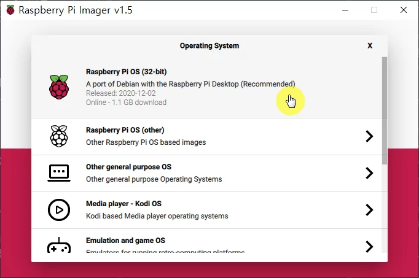

## OS 설치

**라즈비안**(라즈베리파이 OS) 

- 가장 대표적인 OS

### 1. **파이 이미저 설치**

파이 이미저 나오기 전에는 '파이 OS 이미지' 다운 후에 '발리나 에처(balenaEtcher)' 같은 프로그램 사용했어야 함

파이 이미저는 이 두 단계를 하나로 결합한 프로그램

OS 다운로드와 SD 카드 설치를 한 번에 진행할 수 있게 해줌

처음 사용하는 SD 카드라도 포맷을 진행하고 설치를 시작해야 하는데 이 기능을 파이 이미저에서 담당함

- [파이 이미저 다운로드](https://www.raspberrypi.org/software/)

- 각 운영체제에 맞는 버전으로 imager 다운

### 2. **설치 방법**

1) **사용하는 운영체제에 맞게** **라즈베리 파이 이미저 다운**

2) **다운 받은 설치 파일 더블 클릭해서 실행, install 버튼 클릭하여 이미저 설치**

3) **SD카드를 끼우고 리더기를 컴퓨터에 연결, SD카드 리더기를 내장한 노트북일라면 SD카드를 바로 장착**

4) **라즈베리 파이 이미저 실행**

5) **사용할 운영체제 선택, 라즈베리 파이 OS를 설치하려면 Raspbeery Pi Os 선택**

6) **CHOOSE SD CARD 클릭 후 운영 체제 설치할 SD 카드 선택**

7) **WRITE 버튼 클릭, 끝날 때까지 기다리기**

